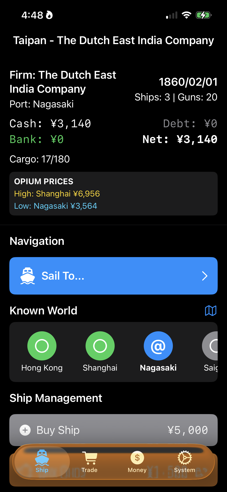
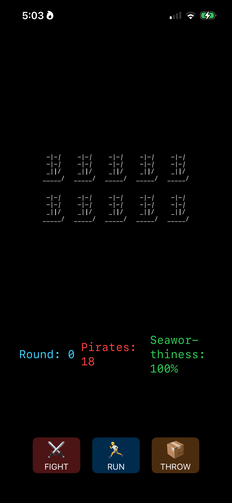
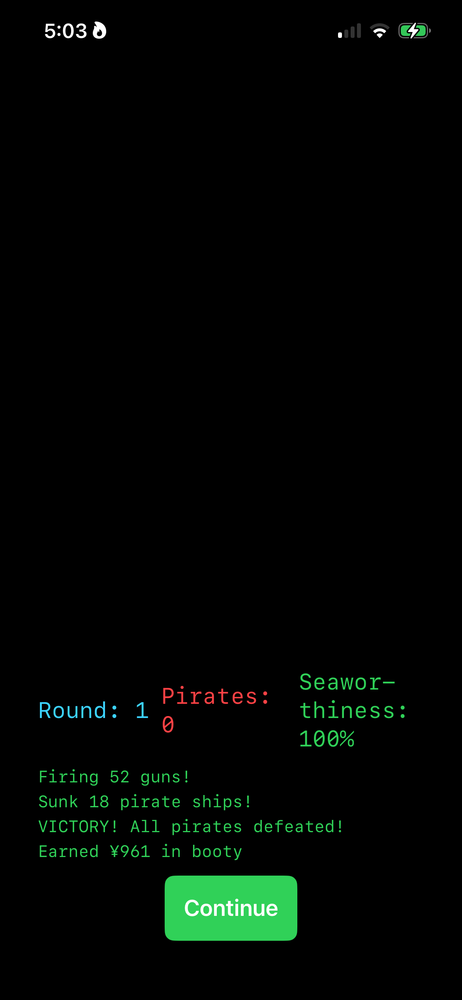

# 🚢 TaipanIOS - Retro Trading Game for iPhone

**Sail the 1860s South China Sea. Build your fortune. Battle pirates. Become a legend.**

TaipanIOS is a faithful iOS port of the classic 1982 Apple II game "Taipan!" - now with SwiftUI goodness and retro-greenscreen vibes on your iPhone.

## 📸 Screenshots

### Main Game Screen

*Navigate the South China Sea - Track your cash, ships, and opium prices across ports*

### Trading Interface

*Buy and sell commodities - Arms at ¥1,443, Silk at ¥387. Watch those debt levels!*

### Combat System

*Pirates attack! 18 enemy ships with lorcha ASCII art. Fight, Run, or Throw cargo!*

### Victory!

*Sunk 18 pirate ships! Earned ¥961 in booty. Retro greenscreen combat log.*

---

## 🎮 What is Taipan?

You're a merchant captain in the dangerous waters of the South China Sea. Trade opium, arms, silk, and general cargo across seven exotic ports. Manage your fleet, dodge pirates, juggle debts, and build your fortune from ¥20,000 to legendary wealth!

**Features:**
- ⚓ Trade across 7 Asian ports (Hong Kong, Shanghai, Nagasaki, Manila, Saigon, Singapore, Batavia)
- 💰 Dynamic market system with realistic price trends
- 🏴‍☠️ Naval combat with original 1982 formulas
- 🏦 Multi-port banking and warehouse system
- 💾 Save/load your trading empire
- 📈 Rank-based retirement system

## 📱 Installing on Your iPhone

### Prerequisites
- A Mac computer running macOS Monterey (12.0) or later
- An iPhone running iOS 16.0 or later
- A free Apple ID (no paid developer account needed!)

### Step 1: Install Xcode (Free!)

1. Open the **App Store** on your Mac
2. Search for **"Xcode"**
3. Click **Get** (it's free, but ~15GB download - grab a coffee!)
4. Wait for installation (can take 30-60 minutes)
5. Open Xcode and agree to the license terms

### Step 2: Get the TaipanIOS Code

**Option A: Download ZIP (Easier)**
1. Go to: https://github.com/michaellavery-grp/taipan_cursed
2. Click the green **Code** button
3. Click **Download ZIP**
4. Unzip the file (double-click the .zip)
5. Navigate to the `TaipanIOS` folder

**Option B: Clone with Git (For Developers)**
```bash
git clone https://github.com/michaellavery-grp/taipan_cursed.git
cd taipan_cursed/TaipanIOS
```

### Step 3: Open the Project

1. Navigate to the `TaipanIOS` folder
2. Double-click **TaipanCursed.xcodeproj**
3. Xcode will open the project

### Step 4: Connect Your iPhone

1. Plug your iPhone into your Mac with a Lightning/USB-C cable
2. On your iPhone: Tap **Trust** when prompted
3. In Xcode, look for the device selector at the top
4. Click it and select **your iPhone's name**

### Step 5: Configure Signing (Important!)

1. In Xcode's left sidebar, click the **blue project icon** (TaipanCursed)
2. Under **TARGETS**, select **TaipanCursed**
3. Click the **Signing & Capabilities** tab
4. Check **Automatically manage signing**
5. Under **Team**, select **your Apple ID**
   - If you don't see your Apple ID:
     - Click **Add Account...**
     - Sign in with your Apple ID
     - Close the window and select your account

6. You may see a warning: "Failed to register bundle identifier"
   - Click on **Bundle Identifier**
   - Change `com.yourdomain.TaipanCursed` to something unique:
   - Example: `com.yourname.TaipanCursed` (use your actual name)

### Step 6: Trust Yourself on iPhone (First Time Only)

1. In Xcode, click the **Play button** (▶️) at the top left
2. Xcode will build and try to install on your iPhone
3. **First time**: You'll see "Untrusted Developer" on your iPhone
4. On your iPhone:
   - Go to **Settings** → **General** → **VPN & Device Management**
   - Tap your **Apple ID email**
   - Tap **Trust "[Your Email]"**
   - Tap **Trust** again to confirm
5. Go back to Xcode and click **Play** (▶️) again

### Step 7: Play!

The game will launch on your iPhone! 🎉

## 🎮 How to Play

### Starting Out
- You begin in **Hong Kong** with ¥20,000 cash and 1 ship (50 cargo capacity)
- Buy goods cheap, sail to another port, sell high - classic trading!
- Use the **four menu buttons** at the bottom to access all game functions

### The Four Menus

**🚢 Ship Menu**
- **Buy Ships**: Expand your fleet (¥10,000 each, more if heavily armed)
- **Sail to Port**: Travel between the 7 ports
- **Repair Ship**: Fix damage from combat or storms
- **Buy Guns**: Arm your fleet for combat (¥500 per gun × ships)

**📦 Trade Menu**
- **Buy Goods**: Purchase at current port prices
- **Sell Goods**: Sell your cargo for profit
- **Store Goods**: Put cargo in warehouse (10,000 capacity per port)
- **Retrieve Goods**: Get cargo from warehouse storage

**💰 Money Menu**
- **Bank Balance**: Check your bank account (Hong Kong/Shanghai only)
- **Deposit**: Store cash safely in the bank
- **Withdraw**: Get cash from your bank account
- **Borrow**: Take loans (max ¥50,000 per port, 10% monthly interest)
- **Pay Debt**: Pay down your debts

**⚙️ System Menu**
- **Save Game**: Save your progress (JSON format)
- **Load Game**: Resume a saved game
- **Retire**: Cash out and see your ranking

### Trading Strategy 101

1. **Watch Price Trends**: Prices change gradually over time (±1-5% per voyage)
   - **Uptrend** (↑): Prices rising - good time to SELL or wait
   - **Downtrend** (↓): Prices falling - good time to BUY cheap

2. **Know Your Price Ranges**:
   - **Opium**: ¥1,000 - ¥9,000 (high profit, high risk)
   - **Arms**: ¥500 - ¥2,500 (good profit, medium risk)
   - **Silk**: ¥230 - ¥510 (steady profit, low risk)
   - **General**: ¥35 - ¥65 (small profit, very safe)

3. **Buy Low, Sell High**:
   - Buy opium in Hong Kong at ¥1,200
   - Sail to Manila and find opium at ¥8,500
   - Profit: ¥7,300 per unit!

4. **Manage Your Fleet**:
   - More ships = more cargo capacity (50 per ship)
   - But ships cost money to buy and repair
   - Start small, expand as you profit

5. **Use Warehouses**:
   - Store goods when prices are low
   - Retrieve and sell when prices spike
   - Each port has 10,000 capacity storage

6. **Leverage Debt Wisely**:
   - Borrow up to ¥50,000 at each port (¥350,000 total across 7 ports!)
   - 10% monthly compounding interest
   - Pay off debt strategically to free up credit at each port

### Combat Tips

When pirates attack:
- **Fight**: Risk damage to your ships but earn booty if you win
- **Run**: Try to escape (chance based on ships, damage, fleet size)
- **Throw Cargo**: Lighten your load to improve escape chances

**Combat Stats**:
- **Our Ships**: Your fleet size (more = better combat)
- **Guns**: Total armament (more = more damage to pirates)
- **Damage**: Ship health percentage (lower = more vulnerable)
- **Enemy Ships**: Pirate fleet size

### Winning the Game

Retire when you've built your fortune! Your rank depends on total assets:

- **Millionaire**: ¥1,000,000+ (Epic!)
- **Wealthy Merchant**: ¥500,000+
- **Successful Trader**: ¥250,000+
- **Merchant**: ¥100,000+
- **Trader**: ¥50,000+
- **Pauper**: Below ¥50,000

## 📚 Learning Swift & iOS Development

**Want to learn how this game was made?** You're in the right place!

### What is Swift?

Swift is Apple's modern programming language for iOS, macOS, and all Apple platforms. It's:
- **Easy to Read**: Looks like English, not cryptic symbols
- **Safe**: Prevents common programming errors
- **Fast**: Compiles to native code
- **Fun**: Build real apps from day one!

### Getting Started with SwiftUI

TaipanIOS is built with **SwiftUI** - Apple's declarative UI framework. Here's how it works:

**Traditional Programming (Imperative)**:
```swift
// You tell the computer EVERY step
label.text = "Hello"
label.textColor = .green
label.fontSize = 24
view.addSubview(label)
```

**SwiftUI (Declarative)**:
```swift
// You describe WHAT you want, SwiftUI figures out HOW
Text("Hello")
    .foregroundColor(.green)
    .font(.system(size: 24))
```

### Explore the Code

The TaipanIOS source code is **heavily commented** to help you learn! Here's the structure:

#### 1. GameModel.swift - The Brain 🧠
This file contains all the game logic:
```swift
class GameModel: ObservableObject {
    @Published var cash: Int = 20000
    @Published var ships: Int = 1
    @Published var currentPort: Port

    func buyShips(_ amount: Int) -> Bool {
        // Game logic here!
    }
}
```

**What you'll learn**:
- Classes and structs
- Properties and methods
- The `@Published` property wrapper (auto-updates UI!)
- Game logic and algorithms

#### 2. ContentView.swift - The Main Screen 📱
Shows the game interface:
```swift
struct ContentView: View {
    @ObservedObject var game: GameModel

    var body: some View {
        VStack {
            Text("Cash: ¥\(game.cash)")
            Text("Ships: \(game.ships)")
        }
    }
}
```

**What you'll learn**:
- SwiftUI views and layouts
- `@ObservedObject` (watches for changes)
- VStack, HStack, ZStack (arranging UI)
- Reactive programming

#### 3. Menu Views - User Interface 🎛️
Each menu (Ship, Trade, Money, System) has its own view file:
- `ShipMenuView.swift`
- `TradeMenuView.swift`
- `MoneyMenuView.swift`
- `SystemMenuView.swift`

**What you'll learn**:
- Buttons and pickers
- Input validation
- Calling game logic functions
- Modular code organization

#### 4. CombatView.swift - Action! ⚔️
The pirate combat interface:
```swift
struct CombatView: View {
    @ObservedObject var game: GameModel

    var body: some View {
        VStack {
            Text("Pirates sighted!")
            HStack {
                Button("Fight") { game.fight() }
                Button("Run") { game.run() }
                Button("Throw Cargo") { game.throwCargo() }
            }
        }
    }
}
```

**What you'll learn**:
- State management during gameplay
- Button actions and callbacks
- Displaying dynamic data

### Free Learning Resources

**Apple's Official Tutorials**:
- [SwiftUI Tutorials](https://developer.apple.com/tutorials/swiftui) - Start here!
- [100 Days of SwiftUI](https://www.hackingwithswift.com/100/swiftui) - Free course by Paul Hudson

**YouTube Channels**:
- **CodeWithChris** - Beginner-friendly SwiftUI tutorials
- **Sean Allen** - iOS development best practices
- **Stewart Lynch** - Step-by-step app building

**Books**:
- "SwiftUI for Absolute Beginners" by Jayant Varma
- "SwiftUI by Tutorials" by raywenderlich.com

### Experiment with TaipanIOS!

**Try These Modifications** (Easy → Hard):

**🟢 Easy - Change Starting Cash**
1. Open `GameModel.swift`
2. Find: `@Published var cash: Int = 20000`
3. Change to: `@Published var cash: Int = 100000`
4. Hit **Play** (▶️) - you're rich!

**🟡 Medium - Add a New Commodity**
1. Open `GameModel.swift`
2. Find the `commodities` dictionary (around line 146)
3. Add: `"tea": Commodity(basePrice: 200, volatility: 0.4)`
4. Add "tea" to cargo and warehouse initializations
5. Update `TradeMenuView.swift` to show tea

**🔴 Hard - Implement Storm System**
1. Study the Perl version (`../test_storm_mechanics.pl`)
2. Add a `storm()` function to `GameModel.swift`
3. Call it randomly (10% chance) in the `sail()` function
4. Implement ship sinking based on damage
5. Add UI alerts for storms

### Join the Community!

- **Swift Forums**: https://forums.swift.org
- **r/iOSProgramming**: Reddit community for iOS devs
- **Stack Overflow**: Tag your questions with `[swift]` and `[swiftui]`

## 🐛 Found a Bug?

Open an issue on GitHub:
https://github.com/michaellavery-grp/taipan_cursed/issues

Include:
- iOS version
- Steps to reproduce
- What happened vs. what you expected
- Screenshots if possible

## 🎨 Want to Contribute?

Pull requests welcome! Some ideas:
- Add Li Yuen the Pirate Lord encounter system
- Implement storm mechanics (sinking, blown off course)
- Add robbery and bodyguard system
- Create time-based warehouse events
- Design custom UI themes
- Add sound effects and music
- Implement Game Center leaderboards

## 📜 Credits

### Original Game
- **Taipan!** (1982) - Art Canfil for the Apple II

### Perl Terminal Version
- **Michael Lavery** (2020-2025) - Curses::UI remake with modern enhancements

### iOS Port
- **Claude-Coded** by Claude AI (Anthropic) - November 2025
- Often called "vibe coding" in the tech news lately! 🤖✨

### Special Thanks
- Michael Lavery for bug reports, testing, and keeping the retro gaming spirit alive
- The Perl community for maintaining classic gaming traditions
- Apple for making iOS development accessible with Swift & SwiftUI
- The retro gaming community for preserving 1980s classics

## 📄 License

Same as the parent Perl project - check the parent directory for LICENSE details.

## 🌊 May Fair Winds Fill Your Sails, Taipan!

Got questions? Open an issue or start a discussion on GitHub!

Happy trading! ⚓💰🏴‍☠️

---

**Version**: 1.0.0
**Last Updated**: November 20, 2025
**Minimum iOS**: 16.0
**Xcode**: 14.0+
**Vibe**: Retro Greenscreen Goodness™
